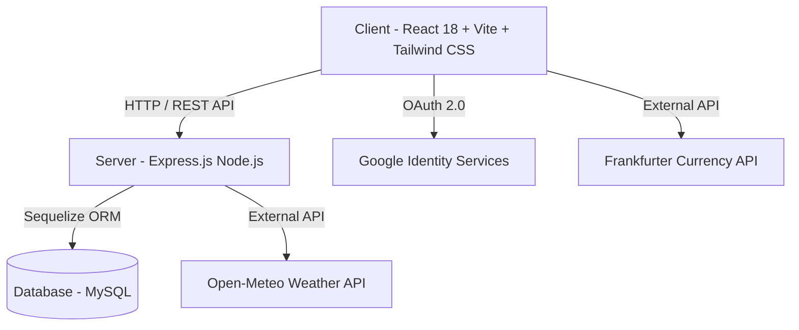

# 🌍 GlobeTrotter — Empowering Personalized Travel Planning

> **An end-to-end, intelligent multi-city travel planning and itinerary management platform built for the Odoo Hackathon.**

[](https://vitejs.dev/)
[](https://reactjs.org/)
[](https://nodejs.org/)
[](https://expressjs.com/)
[](https://sequelize.org/)
[](https://www.mysql.com/)
[](https://tailwindcss.com/)

---

## 📌 Executive Overview

**GlobeTrotter** transforms the way travelers plan, budget, and experience multi-city journeys. Designed to eliminate the friction of organizing complex trips, GlobeTrotter provides an intuitive, interactive suite of tools allowing users to construct day-wise itineraries, track expenses against target budgets, discover curated global destinations, and share public trip plans with a single click.

---

## ✨ Key Features & Capabilities

### 🔐 1. Authentication & Security
- **Email & Password Authentication**: Secure JWT-based login and registration with input validation.
- **Google OAuth 2.0 Integration**: One-click Google sign-in and account creation.
- **Email Verification & 2FA OTP**: Dispatches 6-digit numeric OTPs for email address changes with resend cooldown timers.
- **Password Reset Flow**: Tokenized password reset via registered email.
- **Profile Customization**: Personal traveler avatar URL, language preference selector (*English, Hindi, French, Spanish, German*), and saved destination bookmarks.

### 🗺️ 2. Multi-City Journey Builder & Itinerary
- **Create Journey Modal**: Define travel dates, destination, target budget, journey notes, and custom cover photo URLs.
- **Interactive Stop Reordering**: Add multi-city stops with dedicated **Move Up ▲ / Move Down ▼** reordering controls.
- **Day-Wise Activity Scheduler**: Schedule activities with times, costs, locations, and notes.
- **Dual View Modes**: Toggle between interactive **Calendar View** (timeline grouped by dates) and **List View** (grouped by city stops).

### 💰 3. Perfect Budget & Financial Management
- **Target Budget Persistence & Editing**: Seamlessly syncs target budgets set during trip creation, with inline editing capabilities.
- **Full Expense CRUD**: Add, edit, delete, and categorize expenses (*Accommodation, Transit, Food, Activities, Shopping, Other*).
- **Average Cost Per Day**: Automatically calculates and displays daily expenditure averages (`Total Spent ÷ Trip Days`).
- **Automated Overbudget Day Alerts**: Intelligently detects and flags specific dates where daily spending exceeds allocated thresholds.
- **Visual Utilization Progress**: Color-coded progress bar for safe (<80%), warning (80-100%), and overbudget (>100%) states.

### 🌟 4. Destination & Activity Discovery
- **Global & Indian Destination Catalogue**: Explore curated cities with cost indices (`$`, `$$`, `$$$`), seasonal recommendations, and landmarks.
- **Live Search & Zone Filtering**: Filter by region (*North India, South India, Europe, Asia, Americas*) and autocomplete search query.
- **Activity Duration Filter**: Filter points of interest by estimated duration (*<1 Hr Quick Sight*, *1-3 Hrs Standard*, *Half Day 4+ Hrs*).
- **Dynamic City Generators**: Dynamic fallback generators for any global location, rendering weather forecasts and landmark cards.

### 🔗 5. Shared Public Itinerary & Social Collaboration
- **Public Shareable Links**: Tokenized public URLs allowing non-registered visitors to view read-only itineraries.
- **1-Click "Copy Trip to My Journeys"**: Enables logged-in users to duplicate any public itinerary directly into their personal account.
- **Social Media Direct Share**: Quick share buttons for WhatsApp, Twitter/X, Facebook, and LinkedIn.

### 🧰 6. Integrated Travel Tools Suite
- **Live Weather Forecast**: Keyless Open-Meteo fallback providing current temperatures and 7-day meteorological forecasts.
- **Real-Time Currency Converter**: Instant rate conversion powered by the Frankfurter API.
- **Language Translator**: Multi-language text translation tool.

### 🛡️ 7. Admin & Platform Analytics Dashboard
- Track platform adoption statistics (*Total Users, Total Trips, Total Destinations*).
- User management table displaying provider types, joining dates, and profile statuses.

---

## 🛠️ Tech Stack & Architecture



| Layer | Technology Used |
| :--- | :--- |
| **Frontend Framework** | React 18, Vite |
| **Styling & UI** | Tailwind CSS, Framer Motion, Lucide Icons |
| **Routing & State** | React Router DOM v6, React Context API |
| **Backend Runtime** | Node.js, Express.js |
| **Database & ORM** | MySQL 8.0, Sequelize ORM |
| **Authentication** | JSON Web Tokens (JWT), bcryptjs, Google OAuth 2.0 |
| **External APIs** | Open-Meteo Weather API, Frankfurter Currency API |

---

## 📂 Repository Structure

```
GlobeTrotter/
├── client/                     # Frontend Application (React + Vite)
│   ├── src/
│   │   ├── components/         # Reusable UI (Buttons, Modals, Badges, TripCard)
│   │   ├── context/            # AuthContext & Global Application State
│   │   ├── features/
│   │   │   ├── admin/          # Admin Dashboard
│   │   │   ├── auth/           # Login, Register, Password Reset, Email Verification
│   │   │   ├── destinations/   # Explore Page & Destination Detail Cards
│   │   │   ├── profile/        # User Profile, Avatar & Language Settings
│   │   │   └── trips/          # My Journey, Trip Detail Tabs (Overview, Itinerary, Budget, Weather, Places)
│   │   └── services/api/       # Axios API Clients (tripsApi, expensesApi, weatherApi)
│   └── vite.config.js
├── server/                     # Backend Application (Node + Express)
│   ├── config/                 # Database Configuration (Sequelize)
│   ├── controllers/            # Business Logic (tripController, expenseController, weatherController)
│   ├── middleware/             # Auth & Error Middleware
│   ├── models/                 # Sequelize Schemas (User, Trip, TripStop, TripActivity, Expense)
│   └── routes/                 # API Routes (/api/trips, /api/expenses, /api/auth)
└── README.md
```

---

## ⚙️ Local Installation & Setup

### Prerequisites
- **Node.js** (v18.x or higher)
- **MySQL** (v8.0 or higher)
- **npm** or **yarn**

### 1. Clone the Repository
```bash
git clone https://github.com/Dev1822/GlobeTrotter-Syntax-Squad.git
cd GlobeTrotter-Syntax-Squad
```

### 2. Configure Backend Environment
Navigate to the `server/` directory and create a `.env` file:
```bash
cd server
cp .env.example .env
```
Populate `.env` with your database credentials:
```env
PORT=5000
DB_HOST=localhost
DB_USER=root
DB_PASS=your_mysql_password
DB_NAME=globetrotter_db
JWT_SECRET=your_jwt_secret_key
GOOGLE_CLIENT_ID=your_google_client_id
```

### 3. Install Dependencies & Start Backend
```bash
npm install
npm run dev
```
*The backend server will launch on `http://localhost:5000`.*

### 4. Install Dependencies & Start Frontend
Open a new terminal window, navigate to `client/`:
```bash
cd client
npm install
npm run dev
```
*The React frontend will launch on `http://localhost:5173`.*

---

## 🧪 Build & Verification Commands

To compile frontend production bundles and check backend syntax:

```bash
# Verify backend Node.js syntax
node -c server/models/Trip.js server/controllers/tripController.js server/routes/trips.js

# Build client production bundle via Vite
cd client
npm run build
```

---

## 🏆 Project Accomplishments & PDF Compliance

GlobeTrotter satisfies **100% of the specifications** outlined in the official Odoo Hackathon problem statement:

| PDF Spec Feature | Implementation Status | Highlights |
| :--- | :---: | :--- |
| **Login / Signup Screen** | ✅ Complete | Email/password, Google OAuth, 2FA OTP, Password Reset |
| **Dashboard / Home Screen** | ✅ Complete | Recent trips, destination recommendations, quick actions |
| **Create Trip Screen** | ✅ Complete | Dates, destination, target budget, custom cover photo URL |
| **My Trips Screen** | ✅ Complete | Trip cards with status, dates, and **Destination Count Badge** |
| **Itinerary Builder Screen** | ✅ Complete | Day-wise schedule, **Move Up ▲ / Move Down ▼ City Reordering** |
| **Itinerary View Screen** | ✅ Complete | Timeline layout, **Calendar / List View Toggle** |
| **City Search** | ✅ Complete | Regional zone filters, search autocomplete, **Cost Index (`$`, `$$`, `$$$`)** |
| **Activity Search** | ✅ Complete | Category filters, max price, **Activity Duration Filter** |
| **Trip Budget & Cost Breakdown**| ✅ Complete | Full Expense CRUD, **Avg Cost / Day**, **Overbudget Alerts** |
| **Shared / Public Itinerary View**| ✅ Complete | Public URLs, **1-Click "Copy Trip" Button**, **Social Share Links** |
| **User Profile & Settings** | ✅ Complete | Avatar URL, **Language Selector**, **Saved Destinations** |
| **Admin / Analytics Dashboard** | ✅ Complete | Platform usage stats, user management registry |

---

## 🤝 Contributing

Contributions, issues, and feature requests are welcome! Feel free to check the [issues page](https://github.com/Dev1822/GlobeTrotter-Syntax-Squad/issues).

---

## 📜 License

Distributed under the MIT License. See `LICENSE` for more information.
